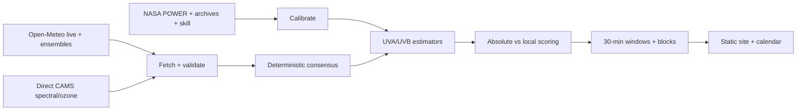

<div align="center">

# SunStack TanScore

**A strict, source-transparent solar/UV forecast and calibration stack.**

[](https://github.com/carterlasalle/openmeteo-sunstack-tanscore/actions/workflows/run.yml)


[Live forecast](https://carterlasalle.github.io/openmeteo-sunstack-tanscore/) · [Getting started](#quick-start) · [Scores](#scores) · [Safety model](#safety-model) · [Contributing](CONTRIBUTING.md)

</div>

SunStack answers two different questions without mixing them up:

1. **How strong is the actual melanogenic radiation on an absolute global scale?**
2. **How good is this outdoor tanning opportunity here, given local climatology, forecast confidence, rain/snow, and temperature?**

It fetches live Open-Meteo forecasts, full ensemble data, native HRRR sub-hourly radiation, CAMS air-quality data, **direct Copernicus CAMS spectral/ozone forecasts**, NASA POWER historical UVA/UVB, archived Open-Meteo forecasts, and previous runs for lead-time skill calibration.

## How it works



Git history is the audit trail: every scheduled run commits its export, so any published number traces back to the exact inputs that produced it. Strict mode refuses to publish rather than score blind.

## Scores

Every hour and 30-minute period exposes the components separately:

| Score | What it means |
|---|---|
| `tan_score_absolute_0_100` | Globally anchored melanogenic intensity: 100 * E_mel / fixed global reference. **Not** graded on a South Bend curve |
| `local_tan_score_0_100` | Percentile versus historical daylight around this location and season (rebuilt with v4 scores) |
| `atmospheric_quality_percentile_0_100` | Local percentile after controlling for season and solar elevation |
| `tan_forecast_confidence_0_100` | Trust in the window from deterministic/ensemble evidence + CAMS/Open-Meteo UVI agreement |
| `outdoor_feasibility_0_100` | Practical outdoor usability only |
| `overall_tan_opportunity_0_100` | The easy-to-read overall number |

Doses are reported separately from intensity (never ranked as intensity):

| Dose | What it means |
|---|---|
| `tan_dose_*_j_m2` | Model-defined melanogenic-effective cumulative exposure (NOT a standardized unit) |
| `sed_*` | Independent erythemal channel; never increases TanScore or Opportunity |
| `uva_dose_*` / `uvb_dose_*` | Diagnostic physical broadband doses, not biological endpoints |

### Overall formula

The unblocked composite is a weighted geometric mean — 60% Absolute, 15% Local, 10% Atmosphere, 15% Confidence — capped at `Absolute + 20`, so local rarity can never turn weak physical UV into a fake elite score. Then it is multiplied by outdoor feasibility.

```text
Absolute    44
Local       97
Atmosphere  94
Confidence  91
Overall     ~60 before weather usability
```

That reads as **excellent for South Bend but only moderate on an absolute terrestrial scale** — both true at once.

## Outdoor hard blocks and flags

Outdoor usability is deliberately separate from melanogenesis physics.

Default hard blocks (Overall = 0, Absolute untouched): active rain/drizzle/showers, active snow, thunderstorm, temperature `< 50°F` (configurable) or `>= 110°F`. Soft penalties: 50–68°F cold comfort, 100–110°F heat, precipitation probability, high wind, hot + humid.

A `uv_input_disagree` flag fires when broadband and UV inputs describe different skies (per-variable model stitching on convective days); it halves confidence and prints a visible note rather than hiding the disagreement. Thresholds in `.env.example` / environment variables.

## Fitzpatrick skin type

Dashboard and CLI accept optional Fitzpatrick I–VI (`uv run sunstack run --skin-type 2`, or the UI selector). It is **qualitative personal-response/risk context only** — it never multiplies environmental TanScore, because measured MED/MMD overlaps substantially within Fitzpatrick groups.

For a measured or defensibly estimated personal MMD in melanogenic-effective J/m², `uv run sunstack run --personal-mmd 12000 --personal-mmd-basis MEASURED` adds `personal_mmd_fraction` (TanDose ÷ personal MMD) with its provenance label — still without touching environmental physics. Dashboard/API personalization inputs are a follow-up; CLI covers runs and summaries today.

## Quick start

### Prerequisites

- Python `3.13`
- [uv](https://docs.astral.sh/uv/)
- Git

```bash
git clone https://github.com/carterlasalle/openmeteo-sunstack-tanscore.git
cd openmeteo-sunstack-tanscore
uv sync
```

### 1. Configure Copernicus ADS

Create a free Copernicus Atmosphere Data Store account, accept the CAMS dataset terms, and configure standard `cdsapi` credentials (`~/.cdsapirc`). Then verify everything (`--probe` makes **real live Open-Meteo requests**):

```bash
uv run sunstack doctor --probe
```

### 2. One-command full setup

```bash
uv run sunstack setup
```

Fetches NASA POWER UVA/UVB (2001+), Open-Meteo historical forecasts, previous runs, CAMS EAC4; trains UVA/UVB estimators; builds the local reference distribution and model/lead-time skill; then makes a fresh live run. Strict is the default: a missing critical source exits non-zero instead of inventing values. Troubleshooting only: `uv run sunstack run --allow-degraded`.

### 3. Daily use

```bash
uv run sunstack ui    # dashboard at http://127.0.0.1:8765
uv run sunstack run   # terminal run (live cache bypassed by default)
```

## Architecture

```text
src/sunstack/
  cli.py           run / setup / bootstrap / doctor / ui / export
  fetch.py         live Open-Meteo fan-out (deterministic, ensemble, HRRR-15min, air quality)
  history.py       NASA POWER, archives, previous runs, CAMS EAC4 + direct CAMS forecast
  normalize.py     per-source normalization
  derive.py        consensus, ensemble probabilities, solar diagnostics
  tanscore.py      UVA/UVB estimators, action-spectrum absolute scoring, UVI fusion
  photobiology.py  E_mel / TanDose / SED core, spectra validation, strict gates
  spectral.py      skin-plane spectral layer, tiers A-D, Tier-C broadband mapping
  doses.py         trapezoidal TanDose/SED/UVA/UVB integration with gap flags
  tan_response.py  future delayed-pigmentation response interface (not shipped)
  opportunity.py   30-min forecast, outdoor feasibility, daily summaries, Fitzpatrick context
  validation.py    strict gates (sources, CAMS fields, photobiology, score ranges)
  output.py        static-site + calendar export
  ui.py            dashboard, data + refresh + calendar APIs
  calibrate.py     training + local reference (v4 rebuilt) + skill
data/
  latest/          current snapshot (summary, raw manifests, tables)
  runs/            every run, timestamped
  calibration/     models, reference distribution, skill
  research/action_spectra/  versioned action spectra + provenance metadata
docs/              published static site (each run republishes)
```

## Safety model

SunStack intentionally makes silent degradation inconvenient:

- Every normal `run` bypasses the live HTTP cache — forecasts represent real requests, not stale reads. (`--cached-live` only when deliberate.)
- Strict mode validates Best Match, HRRR 15-min, air quality, minimum deterministic/ensemble counts, calibration artifacts, direct CAMS fields, and score ranges. Any critical failure exits 1 with the exact failure plus the path to `data/logs/sunstack.log`.
- Historical data *is* cached (immutable decades shouldn't be redownloaded); `--force` refetches deliberately.
- `uv run sunstack debug` prints the latest run summary and raw source manifest.

## Data sources

Live (uncached by default): Best Match, HRRR, NBM, NAM, GFS/AI-GFS, ECMWF IFS/AIFS, ICON, GEM + HRDPS, UKMO, ACCESS, CMA GRAPES, full-member GEFS/AIGEFS/ECMWF ensembles, ensemble means, native HRRR 15-minute, CAMS air quality/AOD550, deep pressure profiles.

Direct CAMS/ADS (strict-required): AOD and absorption AOD at 340/355/380/400 nm, single-scattering albedo, asymmetry factor, total-column ozone and water vapour, cloud liquid/ice columns, forecast albedo, CAMS UV diagnostics. Group requests first, per-variable retry on rejection, exact failures in `raw/cams_forecast/manifest.json`.

## 30-minute semantics

Near-term periods use native HRRR radiation/weather at true sub-hourly timestamps; hourly UV is interpolated with a bounded HRRR broadband correction. Farther out, rows are labeled `interpolated_hourly` — calendar/UI usability, not fake independent forecasts.

## Important interpretation

TanScore is an environmental/pigmentation-potential model, **not a safe exposure-time recommendation**. Tanning and erythema are both consequences of UV exposure; no skin type makes a UV dose harmless. The UI keeps radiation intensity, local context, weather feasibility, and personal skin-response context separate rather than synthesizing exposure-time advice.

## Documentation

| Document | Purpose |
|---|---|
| [CONTRIBUTING.md](CONTRIBUTING.md) | Development workflow and pull-request standards |
| [SECURITY.md](SECURITY.md) | Supported versions and vulnerability reporting |
| [AGENTS.md](AGENTS.md) | Repository-specific instructions for coding agents |
| [RESEARCH_NOTES.md](docs/RESEARCH_NOTES.md) | Dated calibration and incident evidence log |
| [PHOTOBIOLOGY_MODEL.md](docs/PHOTOBIOLOGY_MODEL.md) | v4 action-spectrum model, equations, interaction-term evidence |
| [TANDOSE.md](docs/TANDOSE.md) | TanDose definition (model-defined, not standardized) |
| [ACTION_SPECTRA.md](docs/ACTION_SPECTRA.md) | Spectrum provenance, tiers, interpolation rules |
| [SPECTRAL_MODEL.md](docs/SPECTRAL_MODEL.md) | Spectral layer, tiers A-D, skin-plane physics |
| [.env.example](.env.example) | Every tunable threshold |

## Contributing

Solo-owner mode with required checks; read [CONTRIBUTING.md](CONTRIBUTING.md) before making changes. Run `uv run pytest tests/ -q` and `uv run ruff check src tests` before opening a pull request.
